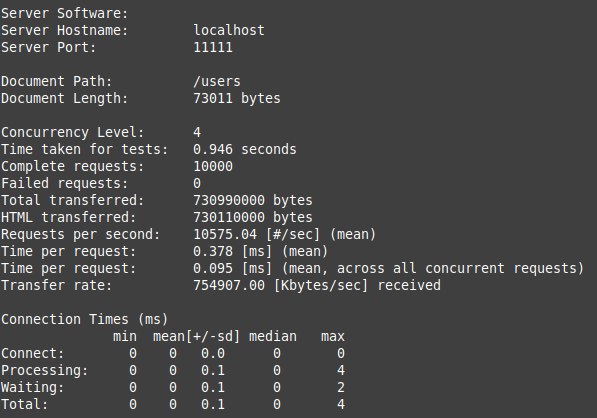
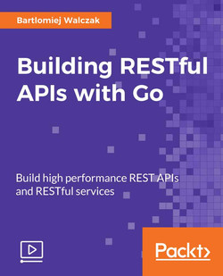

# Building RESTful APIs with Go

building and deploying RESTful web services in a production environment. It also covers making APIs more secure using basic authentication and encrypted JSON. Additionally, it emphasizes the importance of securing Go applications for deployment with scalability in mind.

## Prerequisites

- [Go dev](https://go.dev/)
- [Postman](https://www.postman.com/)

## Tech Stack

- Go
- RESTful APIs
- Bolt: key/value database for Go
- Echo: High performance, minimalist Go web framework
- JWE
- Caching
- Middleware

## Deployment

To deploy this project run

### Git clone

```bash
  git clone https://github.com/eafit-201620030010/go-restful-apis.git
```

### Run server

```bash
go run main.go
```

## Run unit tests

### Unit test user

```bash
# for user

cd user
go test

# coverage report

go test -coverprofile=coverage.out
go tool cover -html=coverage.out
```

### Unit test handlers

```bash
# for handlers

cd handlers
go test

# coverage report

go test -coverprofile=coverage.out
go tool cover -html=coverage.out
```

### Unit test cache

```bash
# for cache

cd cache
go test

# coverage report

go test -coverprofile=coverage.out
go tool cover -html=coverage.out
```

## Benchmarks in Go

Package testing provides support for automated testing of Go packages.

### Benchmarks test handlers

```bash
go test -bench .
goos: linux
goarch: amd64
pkg: jjchavarrg.com/go-api/handlers
cpu: Intel(R) Core(TM) i5-4200M CPU @ 2.50GHz
BenchmarkGetAllNonCached-4   	    3506	    346502 ns/op
BenchmarkGetAllCached-4      	  150472	      7788 ns/op
```

### Benchmarks test user

```bash
go test -bench .
goos: linux
goarch: amd64
pkg: jjchavarrg.com/go-api/user
cpu: Intel(R) Core(TM) i5-4200M CPU @ 2.50GHz
BenchmarkCreate-4   	      51	  39245090 ns/op
BenchmarkRead-4     	    4006	    322813 ns/op
BenchmarkUpdate-4   	      73	  17991037 ns/op
BenchmarkDelete-4   	      72	  18813862 ns/op
BenchmarkCRUD-4     	      16	  82204860 ns/op
```

## Apache Bench

| No cache                                                              | Cache                                              |
| --------------------------------------------------------------------- | -------------------------------------------------- |
| `ab -n 10000 -c 4 -H "Cache-Control: no-cache" localhost:11111/users` | `ab -n 10000 -c 4 localhost:11111/users`           |
|                   |  |
| Time taken for tests: 39.415 seconds                                  | Time taken for tests: 0.946 seconds                |
| Requests per second: 253.71 [#/sec] (mean)                            | Requests per second: 10575.04 [#/sec] (mean)       |

## Postman colletion

[Colletion Json](./postman)

## Documentation



## License

[MIT](https://choosealicense.com/licenses/mit/)
